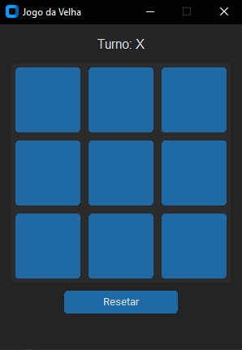
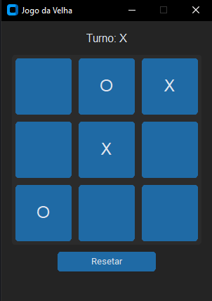
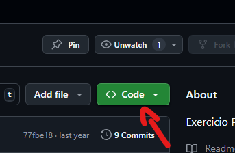
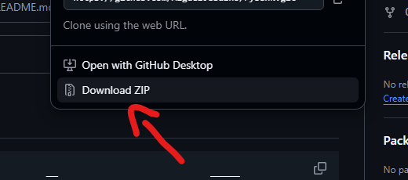

# 👵 Jogo da Velha
um joguinho simples baseado no famoso jogo da velha, ótimo para praticar interface grafica, programação orientada a objetos e logica

## 📷 Screenshot
<div align="center">
    
    
</div>

## 🧱 funcionamento
O jogo se divide em turnos, cada jogador faz uma jogada por vez, aquele que completar uma linha, coluna ou linha diagonal ganha.

## 🛠️ Técnologias
- Python3
- CustomTkinter (interface grafica)
- tkinter (caixa de mensagem para indicar o ganhador)

## ▶️ Como jogar 
### ✅ Se você **tem o Git instalado**:
1.  o primeiro passo é clonar o repositório com o seguinte comando: 
    ```Bash
    git clone https://github.com/MiguelJesuino/Jogo_da_velha
    ```
2. instale as dependencias com o seguinte comando:
    ```Bash
    pip -r requeriments.txt
    ```
3. agora é só navegar até a pasta e executar
   ```Bash
   cd /Jogo_da_velha   # cd = change directory(mudar diretório)
   python3 jogoDaVelha.py  # executando o jogo 
   ```

### ❌ Se você **não tem o Git**:
1. Baixe o repositório como `.zip`:
<div align="center">
    
    
</div>

2. Extraia o conteúdo e abra a pasta `Jogo_da_velha`.
3. No terminal/prompt de comando, execute:
    ```bash
    pip install -r requirements.txt
    python3 jogoDaVelha.py
    ```
   
## 📁 Estrutura do Projeto
```Bash
Jogo_da_velha/
├── imagens/ # Capturas de tela e tutoriais
├── jogoDaVelha.py # Código principal do jogo
├── requirements.txt # Lista de dependências
└── README.md # Este arquivo
```

## ✅ Funcionalidades

- Interface gráfica intuitiva
- Jogabilidade entre dois jogadores
- Verificação automática de vitória ou empate
- Caixa de mensagem com resultado da partida

---
Feito por [Miguel Jesuíno](https://github.com/MiguelJesuino)